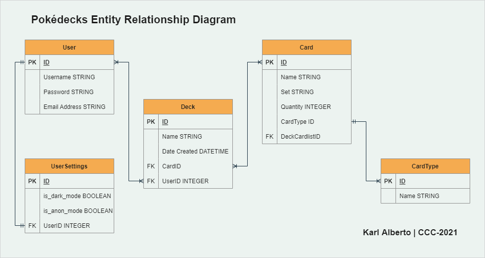

# Pok&eacute;decks - Design Document

CCC-2021 T3A3 - Karl Alberto

---

## Purpose

The _Pok&eacute;decks_ app is designed as an online tool for managing a user/player's _Pokémon Trading Card Game (PTCG)_ cards into _decks_ and _decklists*_. This app is being developed as part of an assignment and portfolio item for the **Coder Academy** ___Coding, Cloud and Cyber___ Bootcamp.

Individual decks are stored in a table, while individual cards are stored in another. For now, each individual card needs to be created by the user. Unfortunately, as each card in a cardlist is added one by one, there is currently no way to avoid duplicate instances of the same card (in separate decks).

Future development work will include the use of the [PTCG API](https://dev.pokemontcg.io/), so that users have proper 'Card Search' functionality, and to also avoid the duplicate entities issue mentioned. More details are available below in 'Professional Obligations' section.

Basic user information and account details will be stored in separate tables, where a user is given the option to modify their site settings (to achieve the one-to-one entity relationship requirement). Current user details required are username, email address, and password. Current site settings available for each user are 'Dark Mode' and 'Anonymous Mode'. Dark Mode is provided as a readability/accesibility option; while Anonymous Mode makes the owner of the deck anonymous to other users of the website.

_(*"Decklist" is the conventional TCG term for the list of cards in a deck. For the purposes of this site/app, the decklist is referred to as a "Cardlist", where decklist may sound like a term used for a list of decks, rather than a list of cards in a deck)_

### Pages

#### List of pages in this app:
* Home Page (with Login/Signup)
    - Short welcome message, with navbar to other pages available on the site.
* User Profile & Settings
    - Shows the current logged in user their details, along with tickbox options to enable either 'Dark Mode' and/or 'Anonymous Mode'.
* My Decks
    - Shows a table of the decks the current user has created.
* User (Deck) Cardlist
    - Displays the list of cards contained within a deck.
* All Decks (from all users of this site)
    - Displays a list of all decks created by all users on the site, _ordered by_ last created.
* Create New Deck / Update Deck
    - Allows a logged in user to name and create a new deck. Update allows the deck name to be updated by the deck's owner.
* Add Card / Update
    - A form page where a user can add a card to a deck by filling in the required fields. All fields need to be populated for a card to be submitted. Update allows details of a card in a deck to be modified.

#### List of pages for future implementation (outside of assignment requirements):
* Card Search (linked to PTCG API)
    - Planned to allow users to search for specific cards that exist within the game. API access will also limit the need to store individual cards in our own database, as we can query the required cards from the API.
* Card View
    - Will show an image of the actual card selected.
* Contact Page
    - To allow users to raise concerns, and submit questions about the site.

### Entity Relationship Diagram

Fields for 'Date Created' are also included in the user and card models for further use/manipulation. The card model also originally included a price field, as this is often a good way to calculate how much a deck would cost a player when planning deck builds. For the purposes of this assignment, I settled with being able to perform aggregation on the total number of cards within a deck, using the SUM query on the Quantity field.

## Data Validation and Integrity Errors

Along with the Deck Name field when creating/updating a deck, most of the Card fields require string inputs (with the majority of other fields taking integers). All models apply data constraints, with strings being limited by length also.

## Security Concerns

Current concerns include:

* No password confirmation step
* No password or email address update capability

Users can only create decks and cards while logged in, facilitated by `flask-login` `login_required` decorator. `SQLAlchemy` protects from injection attacks via limited use of raw SQL within the app.

## Professional, Ethical and Legal Obligations

### Professional

Delivery of core elements of this website and its database is a guarantee (given this is an assessed requirement).

CI/CD plans for this project include reinstating and using the other fields mention in the ERD section above. Being able to provide cost estimates for players is sometimes a good way to steer users in the right direction when learning the game.

Dark Mode is currently under construction on the site and currently only darkens the background on most pages. Tables and text are unaffected, and the simple contrasting range of colours used makes it easier to "lose" text when switching between modes. This is a simple case of going through each template to add an `if-block` to enable this functionality across the site.

### Ethical

The app currently does not apply a profanity filter; and as the series the game is based off of is very popular among younger children, there is risk of exposure to language that may be deemed inappropriate for their age.

Also related to the inclusion of cost of cards/decks, as this is currently only enabled by user input, this does not automatically update the card entity costs with up to date market costs for single cards. This also opens it up for users to manipulate other details, relating to how the rest of the site works.

### Legal

_Nintendo_ own the rights to the Pok&eacute;mon franchise, and are infamously litigious when it comes to use of their intellectual property. While many sites exist to support, rate, commentate on, and review the card game; concerns on whether Nintendo will apply legal pressure is never zero.

This site uses [Nostalgic CSS](https://nostalgic-css.github.io/NES.css/) and borrows elements heavily inspired by older Nintendo/Pok&eacute;mon games (namely from the older consoles), with some images based on actual characters. Per the warning on the site:

> Nintendo owns the copyright of these characters. Please comply with the Nintendo guidelines and laws of the applicable jurisdiction.

---

Karl Alberto | CCC-2021